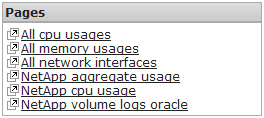
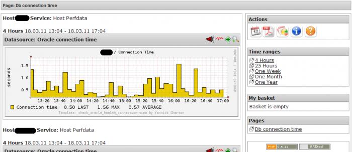

Pnp4Nagios - Pages with contact property
-----------------------------------------------------------------------------------------------

Since version 0.6.10, pnp is able to check the logged user authorisations against the mk\_livestatus API. Based on a pnp installation configured with this feature enabled, this article presents a solution for managing custom pages by user (= contact)

# Table of contents

*   [Authorization checks via mk\_livestatus](#Authorization_checks_via_mk_livestatus)
*   [Problems and limits with pages](#Problems_and_limits_with_pages)
*   [Solution of a contact property](#Solution_of_a_contact_property)
*   [Patching pnp4nagios](#Patching_pnp4nagios)
*   [Using the new contact property](#Using_the_new_contact_property)

# Authorization checks via mk\_livestatus
=======================================

Since version 0.6.10, pnp is able to check the logged user authorisations against the mk\_livestatus API. This can be easily turned on in the $PNP6\_HOME/etc/config.php file (or your custom config\_local.php file), as following:

```
# Enable/disable authorization checks
$conf'auth\_enabled' = TRUE;
# Livestatus socket path
$conf'livestatus\_socket' = "unix:/usr/local/icinga/var/rw/live"; # activate the authorization check
```

# Problems and limits with pages
==============================

Enabling that feature will filter hosts and services informations available in NConf depending on the logged user. This is extremely interesting in case there are some host/service information which should be available only for particular users (like in nagios/icinga).

However, whereas authorization checks are done on almost all the pnp interface parts, this is not the case on the pages view. Indeed, going to the custom pages part will show you all the available pages.

*   This can be a long list of links, in case of several custom pages configured.
*   Certain pages are only useful for certain person. For exemple, database administrators only care about pages concerning databases, whereas network administrators are more interested by switches and routers statistics.
    Exemple of pages:
    
*   No authorization checks are done, neither on the pages themself, nor on the availability of the data used by the pages.
    Consequently, all the links to the pages are shown, even if the user doesn't have the permissions to access the data concerned by the pages.
    Also, there is some cases where the first/default page shown when going to http://.../pnp4nagios/page  concerns some data not available for the logged user.
    Example:
    

# Solution of a contact property
==============================

To deal with the problems above, i've written a small patch which allows to specify a list of contact in the page definition file. This patch introduces a check between the user authenticated on pnp4nagios and the contacts specified in the pages. This check is done prior to the built of the list of pages. For example, after patching you will be able to define some pages like the following:

```
define page {
 use_regex 0 # 0 = use no regular expressions, 1 = use regular expressions
 page_name mypage
 contact contact_1,contact_2,contact_3
}
```

The contact property is optional.

# Patching pnp4nagios
===================

Download the patch:

*   for pnp 0.6.10, 0.6.11: [zip](contact_in_pages_pnp0611.patch.zip)
*   for pnp 0.6.15 to current (0.6.25): [zip](contact_in_pages_pnp0.6.15.patch.zip)

Note: this patch was produced using the following diff command: diff -Nurb

1.  Backup the file which will be patched:

    ```
    icinga@monitor:$ cp -p $PNP6_HOME/share/application/models/data.php $PNP6_HOME/share/application/models/data.php.orig
    ```

2.  Test the patching process:

    ```
    icinga@monitor:$ cd /usr/local/pnp4nagios
    icinga@monitor:$ patch --dry-run --verbose -p0 < "patch_file"
    ```

3.  Then, if all seem ok, apply the patch:

    ```
    icinga@monitor:$ patch --verbose -p0 < "patch_file"
    ```

# Using the new contact property
==============================

For example: Having the following page definition file db\_time.cfg:

```
define page {
 use_regex 0 # 0 = use no regular expressions, 1 = use regular expressions
 page_name Db connection time
}
define graph {
 host_name DB1,DB2,DB3,DB4,DB5,DB6,DB7,DB8
 service_desc Connection_time
}
```

By default, all the users have access to the pages (but data of pages may be not available if the user has no the needed authorizations). Now, consider that there are the following nagios users : icingaadmin, oracleadmin, networkadmin, systemadmin. You want that just the oracleadmin user has access to that page. Change the page definition as following:

```
define page {
 use_regex 0 # 0 = use no regular expressions, 1 = use regular expressions
 page_name Db connection time
 contact oracleadmin
}
define graph {
 host_name DB1,DB2,DB3,DB4,DB5,DB6,DB7,DB8
 service_desc Connection_time
}
```

Logging with another user, for example systemadmin, you won't see that page in the list anymore 

Logging back with oracleadmin, let's see the list of pages. The user oracleadmin just see the pages for which he is concerned. 

